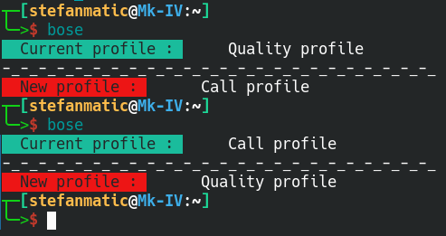
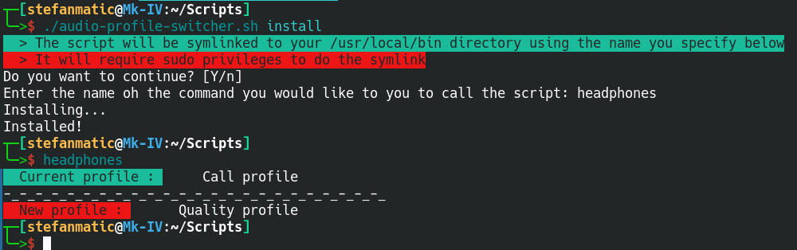

# Audio Profile Switcher for Linux

Lots of bluetooth headphones have two modes, **High Quality** and **Call** mode.

**High Quality** mode provides you with better sound and/or noise cancellation, but doesn't utilize the microphone.

**Call** mode provides less quality but enables the microphone for calls.

The script lets you easily switch between **High Quality** and **Call** mode but just calling the script.



## Why?

Because running a single command is faster then clicking through the GUI.

## Installation

Clone this repository

```bash
git clone https://github.com/stefan-matic/audio-profile-switcher.git
cd audio-profile-switcher
chmod +x audio-profile-switcher.sh
```

Change the values of the following variables to match your device using any text editor:

- DEVICE (run `pactl list cards short` to find your card)
- DEVICE_SINK (run `pactl list sinks short` (remove the profile after last dot))

*You might also need to change the `PROFILE_CALL` and `PROFILE_QUALITY` variables to your device profiles (you can find them by running `pactl list cards` under Profiles of your device)), but to my knowledge most bluetooth headphones have this naming convention*


Run the script with `install` argument to add the script to your `/usr/local/bin` with a custom name to be able to call the script from your terminal.
```bash
./audio-profile-switcher.sh install
```

Follow the prompts on screen and enter the name of the command you would like to use to call the script.



The script does require sudo privileges to be able to copy the script to your `/usr/local/bin` directory.

*Please verify any scripts yourselves before running it with sudo permissions.*

## Usage

Run the script by using the name supplied in the installation step to run the audio switch from the terminal.

If you have multiple bluetooth headphones you can add the first, do the installation, edit the values again for other devices and do the installation again supplying a different name. Rinse and repeat however many times needed.
